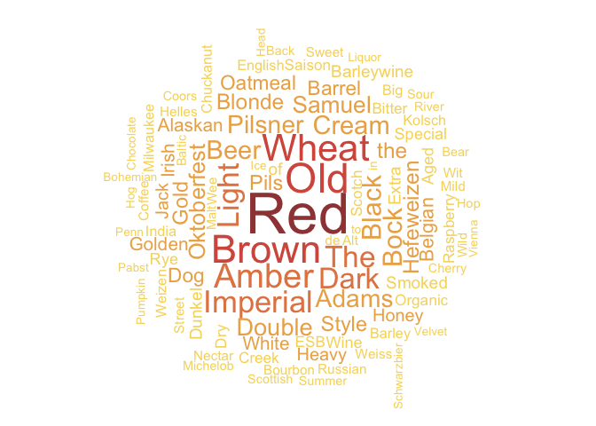

## Beer Awards

### Read in the data

``` r
beer_awards <- readr::read_csv('https://raw.githubusercontent.com/rfordatascience/tidytuesday/master/data/2020/2020-10-20/beer_awards.csv')
```

### Take a look at the data

``` r
beer_awards <- beer_awards %>% mutate(state=str_to_upper(state))
glimpse(beer_awards)
```

    ## Rows: 4,970
    ## Columns: 7
    ## $ medal     <chr> "Gold", "Silver", "Bronze", "Gold", "Silver", "Bronze", "Go…
    ## $ beer_name <chr> "Volksbier Vienna", "Oktoberfest", "Amber Lager", "Lager at…
    ## $ brewery   <chr> "Wibby Brewing", "Founders Brewing Co.", "Skipping Rock Bee…
    ## $ city      <chr> "Longmont", "Grand Rapids", "Staunton", "Concord", "Santa R…
    ## $ state     <chr> "CO", "MI", "VA", "CA", "CA", "IL", "CA", "TX", "OR", "MO",…
    ## $ category  <chr> "American Amber Lager", "American Amber Lager", "American A…
    ## $ year      <dbl> 2020, 2020, 2020, 2020, 2020, 2020, 2020, 2020, 2020, 2020,…

### Map

``` r
US_map <- map_data("state")
US_states <- tibble(region=datasets::state.name, state=datasets::state.abb)
US_states <- US_states %>% mutate(region=str_to_lower(region))
beer_data <- full_join(beer_awards, US_states, by="state")

gold_count <- beer_data %>% filter(medal=="Gold") %>% dplyr::count(region)
state_gold_count <- left_join(US_map, gold_count, by="region")

ggplot() + 
  geom_polygon(data = state_gold_count, aes(x=long, y = lat, group=group, fill=n), color="grey40") + 
  theme_classic() + scale_fill_scico(palette = 'lajolla', begin=0.1, end=0.7) + 
  labs(title="GABF Gold Medal Winners in 1987 - 2020",
       fill= "Gold Medals by State", caption="Data Source: Great American Beer Festival") +
  theme(legend.position="bottom", axis.ticks=element_blank(), axis.line=element_blank(), 
        axis.text=element_blank(), axis.title=element_blank(), 
        text = element_text(family="Courier"))
```

<!-- -->

### Word clouds

Wordclouds from beer names

#### All beers

``` r
beer_name_freq <- beer_data %>% pull(beer_name) %>% str_split(" ") %>% unlist() %>% table() %>% data.frame()
beer_name_freq <- beer_name_freq[order(beer_name_freq[,2], decreasing=TRUE),]

beer_name_freq <- beer_name_freq %>% filter(.!="IPA", .!="Porter", .!="Lager", .!="Stout", .!="Ale", .!="Pale")

wordcloud(beer_name_freq[,1], beer_name_freq[,2], max.words=100, colors=scico(5, palette = 'lajolla', begin=0.2, end=0.7), random.order=FALSE, rot.per=0.3, min.freq=1)
```

<!-- -->

#### Gold medalists

``` r
beer_name_freq <- beer_data %>% filter(medal=="Gold") %>% pull(beer_name) %>% str_split(" ") %>% unlist() %>% table() %>% data.frame()
beer_name_freq <- beer_name_freq[order(beer_name_freq[,2], decreasing=TRUE),]

beer_name_freq <- beer_name_freq %>% filter(.!="IPA", .!="Porter", .!="Lager", .!="Stout", .!="Ale", .!="Pale")

wordcloud(beer_name_freq[,1], beer_name_freq[,2], max.words=100, colors=scico(5, palette = 'lajolla', begin=0.2, end=0.7), random.order=FALSE, rot.per=0.3, min.freq=1)
```

<!-- -->

#### IPAs

``` r
beer_name_freq <- beer_data %>% filter(category=="American-Style India Pale Ale") %>%  pull(beer_name) %>% str_split(" ") %>% unlist() %>% table() %>% data.frame()
beer_name_freq <- beer_name_freq[order(beer_name_freq[,2], decreasing=TRUE),]

beer_name_freq <- beer_name_freq %>% filter(.!="IPA")

wordcloud(beer_name_freq[,1], beer_name_freq[,2], max.words=100, colors=scico(5, palette = 'lajolla', begin=0.2, end=0.7), random.order=FALSE, rot.per=0.3, min.freq=1)
```

<!-- -->

#### Light lagers

``` r
beer_name_freq <- beer_data %>% filter(category=="American-Style Light Lager") %>%  pull(beer_name) %>% str_split(" ") %>% unlist() %>% table() %>% data.frame()
beer_name_freq <- beer_name_freq[order(beer_name_freq[,2], decreasing=TRUE),]

wordcloud(beer_name_freq[,1], beer_name_freq[,2], max.words=100, colors=scico(5, palette = 'lajolla', begin=0.2, end=0.7), random.order=FALSE, rot.per=0.3, min.freq=1)
```

<!-- -->
