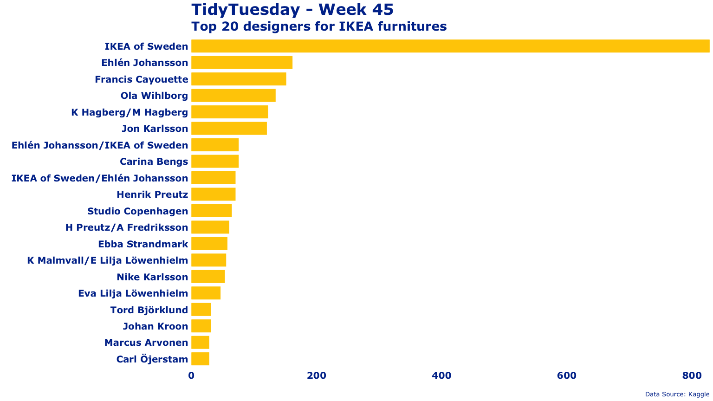

## IKEA Furniture

One liner to plot the top 20 designers for IKEA.

``` r
read_csv('https://raw.githubusercontent.com/rfordatascience/tidytuesday/master/data/2020/2020-11-03/ikea.csv') %>% dplyr::count(designer) %>% arrange(by=n) %>% data.frame() %>% tail(20) %>% ggplot(aes(fct_reorder(designer, n), y=n)) + geom_bar(stat="identity", color="#ffcc00", fill="#ffcc00", width=0.75) + coord_flip() + theme_classic() + labs(y="", x="", title="TidyTuesday - Week 45", subtitle="Top 20 designers for IKEA furnitures", caption="Data Source: Kaggle") + scale_y_continuous(expand=c(0,0)) + theme(axis.line=element_blank(), axis.ticks=element_blank(), plot.title=element_text(size=25, face="bold", family="Verdana", colour="#003399"), plot.subtitle=element_text(size=20, face="bold", family="Verdana", colour="#003399"), plot.caption=element_text(size=10, family="Verdana", colour="#003399"), axis.text=element_text(size=15, face="bold", family="Verdana", colour="#003399"))
```

<!-- -->
