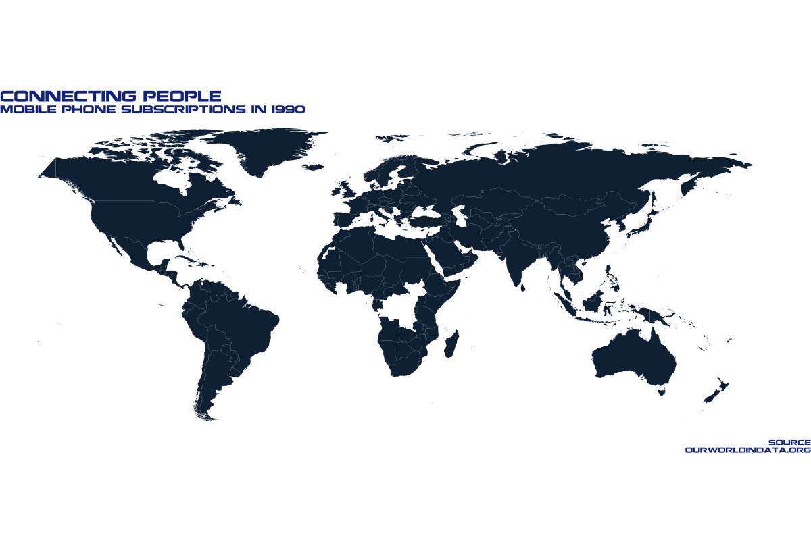

```{r, include=FALSE}
knitr::opts_chunk$set(echo = TRUE)
library(tidyverse)
library(scico)
library(showtext)
library(gganimate)
library(transformr)
```

## Week 46 - Historical Phone Usage

### The Data and Nokia Font
Read in the data and Nokia font
```{r, warning=FALSE, message=FALSE}
mobile <- readr::read_csv('https://raw.githubusercontent.com/rfordatascience/tidytuesday/master/data/2020/2020-11-10/mobile.csv')
glimpse(mobile)
landline <- readr::read_csv('https://raw.githubusercontent.com/rfordatascience/tidytuesday/master/data/2020/2020-11-10/landline.csv')
glimpse(landline)

font_add("Nokia", "./fonts/Nokia.ttf")
showtext_auto()
```

### Some Wrangling

```{r,warning=FALSE, message=FALSE}
phones <- full_join(mobile, landline[,c("code", "year","landline_subs")], by=c("code", "year"))
glimpse(phones)
phones <- phones %>% mutate(ratio = mobile_subs/landline_subs)
glimpse(phones)
```


### Mobile Phones and GDP 

```{r, fig.width=10, fig.height=7, warning=FALSE, message=FALSE}
colors <- scico(5, palette = 'vik')

phones %>% filter(year=="2000") %>% ggplot(aes(x=gdp_per_cap, y=mobile_subs, fill=continent)) + 
  geom_point(size=3, pch=21, col="white") + theme_void() + 
  labs(x="GDP per capita", y="Mobiles per 100 ppl", title="Connecting People", 
       subtitle="Mobile phones per GDP in 2000", caption = "Source\n OurWorldInData.org") + 
  theme(text=element_text(family="Nokia", color="#183693"),
        axis.title.y=element_text(size=10, angle=90, vjust=2), 
        axis.title.x=element_text(size=10, vjust=-2), 
        plot.title=element_text(size=20),
        plot.subtitle=element_text(size=15),
        plot.caption=element_text(size=10),
        axis.text=element_blank(), legend.position="bottom", 
        legend.text=element_text(size=10), 
        plot.margin=unit(c(0.5,0.5,1,1), units="cm")) +
  scale_fill_manual(name="", values=colors)
```

### World Map 

```{r, fig.width=15, fig.height=10, warning=FALSE, message=FALSE}
world <- map_data("world") %>% filter(region!="Antarctica")
colnames(world)[5] <- "entity"
phones$entity <- recode(phones$entity, "United States" = "USA", "United Kingdom" = "UK")
phones_map <- full_join(phones, world, by="entity")

phones_map %>% filter(year=="2000") %>% ggplot() + 
  geom_polygon(aes(x=long, y = lat, group = group, fill=mobile_subs), color="grey40") + theme_void() +
  coord_equal() +
  labs(x="", y="", title="Connecting People", 
       subtitle="Mobile phone subscriptions per 100 ppl in 2000", 
       caption = "Source\n OurWorldInData.org") + 
  theme(text=element_text(family="Nokia", color="#183693"),
        axis.title.y=element_text(size=10, angle=90, vjust=2), 
        axis.title.x=element_text(size=10, vjust=-2), 
        plot.title=element_text(size=20),
        plot.subtitle=element_text(size=15),
        plot.caption=element_text(size=10),
        axis.text=element_blank(), legend.position="bottom", 
        legend.text=element_text(size=10), 
        legend.title=element_blank()) + 
  scale_x_continuous(limits=c(-150, 200)) +
  scale_fill_gradient(breaks=c(0, 40, 80), na.value="white")
```

### Animated World Map
```{r, fig.width=15, fig.height=10, warning=FALSE, message=FALSE}

anim <- phones_map %>% filter(year<2018) %>% ggplot() + 
  geom_polygon(aes(x = long, y = lat, group = group, fill=mobile_subs)) +
  #geom_polygon(data=world, aes(x = long, y = lat, group = group), fill=NA, color="grey40") +
  coord_equal() + transition_manual(year) + theme_void() + 
  labs(x="", y="", title="Connecting People", 
       subtitle="Mobile phone subscriptions in {current_frame}", caption = "Source\n OurWorldInData.org") + 
  theme(text=element_text(family="Nokia", color="#183693"),
        plot.title=element_text(size=20),
        plot.subtitle=element_text(size=15),
        plot.caption=element_text(size=10),
        legend.position="none", 
        legend.title=element_blank()) +
  scale_x_continuous(limits=c(-150, 200)) + 
  scale_fill_gradient(na.value="white")
```

#### Save the animation
```{r, fig.width=15, fig.height=10, warning=FALSE, message=FALSE, eval=FALSE}
animate(anim, 200, fps = 10,  width = 1200, height = 800,
        renderer = gifski_renderer("mobiles_map.gif"), end_pause = 2, start_pause =  2)
```



```{r}
showtext_auto(FALSE)
sessionInfo()
```