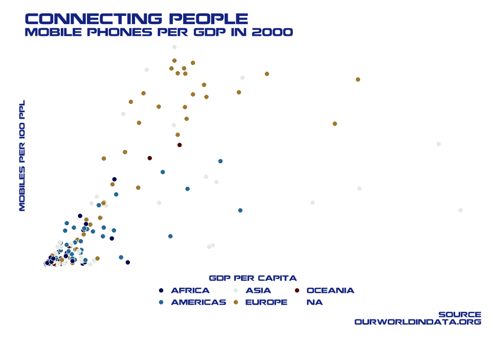

## Week 46 - Historical Phone Usage

### The Data and Nokia Font

Read in the data and Nokia font

``` r
mobile <- readr::read_csv('https://raw.githubusercontent.com/rfordatascience/tidytuesday/master/data/2020/2020-11-10/mobile.csv')
glimpse(mobile)
```

    ## Rows: 6,277
    ## Columns: 7
    ## $ entity      <chr> "Afghanistan", "Afghanistan", "Afghanistan", "Afghanistan…
    ## $ code        <chr> "AFG", "AFG", "AFG", "AFG", "AFG", "AFG", "AFG", "AFG", "…
    ## $ year        <dbl> 1990, 1991, 1992, 1993, 1994, 1995, 1996, 1997, 1998, 199…
    ## $ total_pop   <dbl> 13032161, 14069854, 15472076, 17053213, 18553819, 1978988…
    ## $ gdp_per_cap <dbl> NA, NA, NA, NA, NA, NA, NA, NA, NA, NA, NA, NA, 1063.636,…
    ## $ mobile_subs <dbl> 0.0000000, 0.0000000, 0.0000000, 0.0000000, 0.0000000, 0.…
    ## $ continent   <chr> "Asia", "Asia", "Asia", "Asia", "Asia", "Asia", "Asia", "…

``` r
landline <- readr::read_csv('https://raw.githubusercontent.com/rfordatascience/tidytuesday/master/data/2020/2020-11-10/landline.csv')
glimpse(landline)
```

    ## Rows: 6,974
    ## Columns: 7
    ## $ entity        <chr> "Afghanistan", "Afghanistan", "Afghanistan", "Afghanist…
    ## $ code          <chr> "AFG", "AFG", "AFG", "AFG", "AFG", "AFG", "AFG", "AFG",…
    ## $ year          <dbl> 1990, 1991, 1992, 1993, 1994, 1995, 1996, 1997, 1998, 1…
    ## $ total_pop     <dbl> 12412000, 13299000, 14486000, 15817000, 17076000, 18111…
    ## $ gdp_per_cap   <dbl> NA, NA, NA, NA, NA, NA, NA, NA, NA, NA, NA, NA, 1063.63…
    ## $ landline_subs <dbl> 0.29553158, 0.28475432, 0.20742093, 0.19211533, 0.17931…
    ## $ continent     <chr> "Asia", "Asia", "Asia", "Asia", "Asia", "Asia", "Asia",…

``` r
font_add("Nokia", "./fonts/Nokia.ttf")
showtext_auto()
```

### Some Wrangling

``` r
phones <- full_join(mobile, landline[,c("code", "year","landline_subs")], by=c("code", "year"))
glimpse(phones)
```

    ## Rows: 7,036
    ## Columns: 8
    ## $ entity        <chr> "Afghanistan", "Afghanistan", "Afghanistan", "Afghanist…
    ## $ code          <chr> "AFG", "AFG", "AFG", "AFG", "AFG", "AFG", "AFG", "AFG",…
    ## $ year          <dbl> 1990, 1991, 1992, 1993, 1994, 1995, 1996, 1997, 1998, 1…
    ## $ total_pop     <dbl> 13032161, 14069854, 15472076, 17053213, 18553819, 19789…
    ## $ gdp_per_cap   <dbl> NA, NA, NA, NA, NA, NA, NA, NA, NA, NA, NA, NA, 1063.63…
    ## $ mobile_subs   <dbl> 0.0000000, 0.0000000, 0.0000000, 0.0000000, 0.0000000, …
    ## $ continent     <chr> "Asia", "Asia", "Asia", "Asia", "Asia", "Asia", "Asia",…
    ## $ landline_subs <dbl> 0.29553158, 0.28475432, 0.20742093, 0.19211533, 0.17931…

``` r
phones <- phones %>% mutate(ratio = mobile_subs/landline_subs)
glimpse(phones)
```

    ## Rows: 7,036
    ## Columns: 9
    ## $ entity        <chr> "Afghanistan", "Afghanistan", "Afghanistan", "Afghanist…
    ## $ code          <chr> "AFG", "AFG", "AFG", "AFG", "AFG", "AFG", "AFG", "AFG",…
    ## $ year          <dbl> 1990, 1991, 1992, 1993, 1994, 1995, 1996, 1997, 1998, 1…
    ## $ total_pop     <dbl> 13032161, 14069854, 15472076, 17053213, 18553819, 19789…
    ## $ gdp_per_cap   <dbl> NA, NA, NA, NA, NA, NA, NA, NA, NA, NA, NA, NA, 1063.63…
    ## $ mobile_subs   <dbl> 0.0000000, 0.0000000, 0.0000000, 0.0000000, 0.0000000, …
    ## $ continent     <chr> "Asia", "Asia", "Asia", "Asia", "Asia", "Asia", "Asia",…
    ## $ landline_subs <dbl> 0.29553158, 0.28475432, 0.20742093, 0.19211533, 0.17931…
    ## $ ratio         <dbl> 0.0000000, 0.0000000, 0.0000000, 0.0000000, 0.0000000, …

### Mobile Phones and GDP

``` r
colors <- scico(5, palette = 'vik')

phones %>% filter(year=="2000") %>% ggplot(aes(x=gdp_per_cap, y=mobile_subs, fill=continent)) + 
  geom_point(size=3, pch=21, col="white") + theme_void() + 
  labs(x="GDP per capita", y="Mobiles per 100 ppl", title="Connecting People", 
       subtitle="Mobile phones per GDP in 2000", caption = "Source\n OurWorldInData.org") + 
  theme(text = element_text(family = "Nokia", color="#183693"),
        axis.title.y=element_text(size=10, angle=90, vjust=2), 
        axis.title.x=element_text(size=10, vjust=-2), 
        plot.title=element_text(size=20),
        plot.subtitle=element_text(size=15),
        plot.caption=element_text(size=10),
        axis.text=element_text(size=0), legend.position="bottom", 
        legend.text=element_text(size=10), 
        plot.margin=unit(c(0.5,0.5,1,1), units="cm")) +
  scale_fill_manual(name="", values=colors)
```

<!-- -->

### World Map

``` r
world <- map_data("world") %>% filter(region!="Antarctica")
colnames(world)[5] <- "entity"
phones$entity <- recode(phones$entity, "United States" = "USA", "United Kingdom" = "UK")
phones_map <- full_join(phones, world, by="entity")

phones_map %>% filter(year=="2000") %>% ggplot() + 
  geom_polygon(aes(x=long, y = lat, group = group, fill=mobile_subs), color="grey40") + theme_void() +
  coord_equal() +
  labs(x="", y="", title="Connecting People", 
       subtitle="Mobile phone subscriptions per 100 ppl in 2000", caption = "Source\n OurWorldInData.org") + 
  theme(text = element_text(family = "Nokia", color="#183693"),
        axis.title.y=element_text(size=10, angle=90, vjust=2), 
        axis.title.x=element_text(size=10, vjust=-2), 
        plot.title=element_text(size=20),
        plot.subtitle=element_text(size=15),
        plot.caption=element_text(size=10),
        axis.text=element_text(size=0), legend.position="bottom", 
        legend.text=element_text(size=10), legend.title=element_blank()) + 
  scale_x_continuous(limits=c(-150, 200)) +
  scale_fill_gradient(breaks=c(0, 40, 80), na.value="white")
```

<!-- -->

### Animated World Map

``` r
anim <- phones_map %>% filter(year<2018) %>% ggplot() + 
  geom_polygon(aes(x = long, y = lat, group = group, fill=mobile_subs)) +
  geom_polygon(data=world, aes(x = long, y = lat, group = group), fill=NA, color="grey40") +
  coord_equal() + transition_manual(year) + theme_void() + 
  labs(x="", y="", title="Connecting People", 
       subtitle="Mobile phone subscriptions in {current_frame}", caption = "Source\n OurWorldInData.org") + 
  theme(plot.title=element_text(size=20, family="Nokia", color="#183693"),
        plot.subtitle=element_text(size=15, family="Nokia", color="#183693"),
        plot.caption=element_text(size=10, family="Nokia", color="#183693"),
        legend.position="none", 
        legend.title=element_blank()) +
  scale_x_continuous(limits=c(-150, 200)) + 
  scale_fill_gradient(na.value="white")

#anim
animate(anim, 200, fps = 10,  width = 1200, height = 800,
        renderer = gifski_renderer("./mobiles_map.gif"), end_pause = 2, start_pause =  2)
```

<!-- -->

``` r
showtext_auto(FALSE)
sessionInfo()
```

    ## R version 3.6.2 (2019-12-12)
    ## Platform: x86_64-apple-darwin15.6.0 (64-bit)
    ## Running under: macOS Mojave 10.14.6
    ## 
    ## Matrix products: default
    ## BLAS:   /Library/Frameworks/R.framework/Versions/3.6/Resources/lib/libRblas.0.dylib
    ## LAPACK: /Library/Frameworks/R.framework/Versions/3.6/Resources/lib/libRlapack.dylib
    ## 
    ## locale:
    ## [1] en_US.UTF-8/en_US.UTF-8/en_US.UTF-8/C/en_US.UTF-8/en_US.UTF-8
    ## 
    ## attached base packages:
    ## [1] stats     graphics  grDevices utils     datasets  methods   base     
    ## 
    ## other attached packages:
    ##  [1] transformr_0.1.2.9000 gganimate_1.0.6       showtext_0.9         
    ##  [4] showtextdb_3.0        sysfonts_0.8.1        scico_1.2.0.9000     
    ##  [7] forcats_0.5.0         stringr_1.4.0         dplyr_1.0.2          
    ## [10] purrr_0.3.4           readr_1.3.1           tidyr_1.1.2          
    ## [13] tibble_3.0.3          ggplot2_3.3.2         tidyverse_1.3.0      
    ## 
    ## loaded via a namespace (and not attached):
    ##  [1] httr_1.4.2         maps_3.3.0         jsonlite_1.7.1     modelr_0.1.8      
    ##  [5] assertthat_0.2.1   blob_1.2.1         cellranger_1.1.0   yaml_2.2.1        
    ##  [9] progress_1.2.2     pillar_1.4.6       backports_1.1.10   glue_1.4.2        
    ## [13] digest_0.6.25      rvest_0.3.6        colorspace_1.4-1   plyr_1.8.6        
    ## [17] htmltools_0.5.0    lpSolve_5.6.15     pkgconfig_2.0.3    broom_0.7.0       
    ## [21] gifski_0.8.6       haven_2.3.1        scales_1.1.1       tweenr_1.0.1      
    ## [25] generics_0.0.2     farver_2.0.3       ellipsis_0.3.1     withr_2.2.0       
    ## [29] cli_2.0.2          magrittr_1.5       crayon_1.3.4       readxl_1.3.1      
    ## [33] evaluate_0.14      fs_1.5.0           fansi_0.4.1        xml2_1.3.2        
    ## [37] class_7.3-17       tools_3.6.2        prettyunits_1.1.1  hms_0.5.3         
    ## [41] lifecycle_0.2.0    munsell_0.5.0      reprex_0.3.0       compiler_3.6.2    
    ## [45] e1071_1.7-4        rlang_0.4.8        classInt_0.4-3     units_0.6-7       
    ## [49] grid_3.6.2         rstudioapi_0.11    labeling_0.3       rmarkdown_2.3     
    ## [53] gtable_0.3.0       DBI_1.1.0          curl_4.3           R6_2.4.1          
    ## [57] lubridate_1.7.9    knitr_1.29         utf8_1.1.4         KernSmooth_2.23-17
    ## [61] stringi_1.5.3      Rcpp_1.0.5         vctrs_0.3.4        sf_0.9-6          
    ## [65] dbplyr_1.4.4       tidyselect_1.1.0   xfun_0.17
